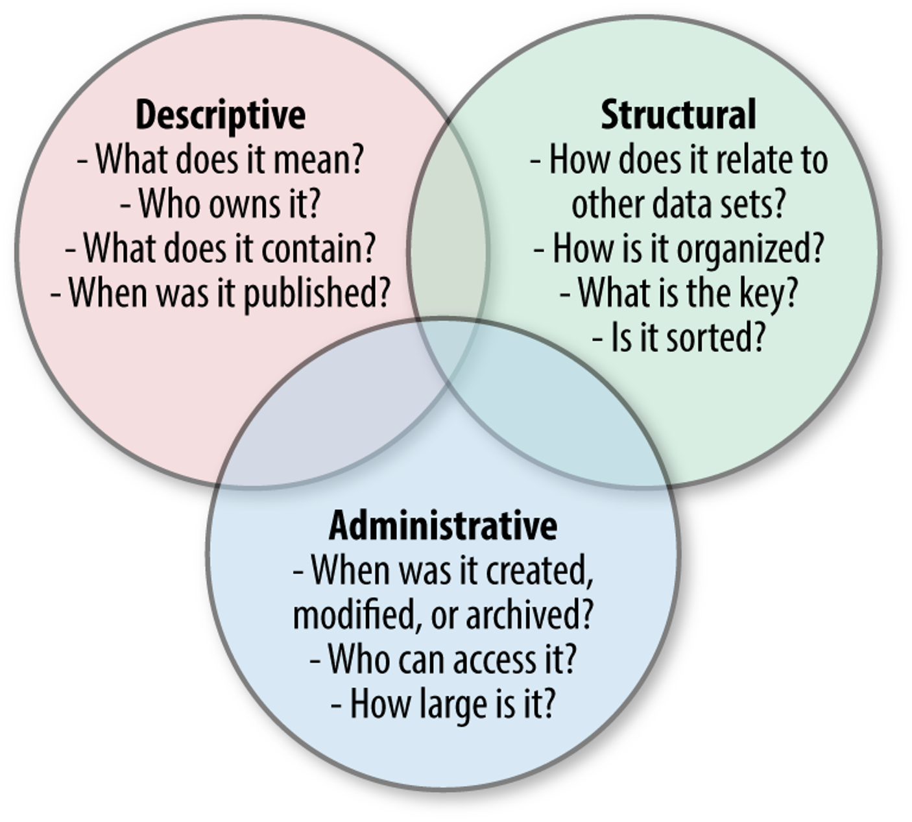
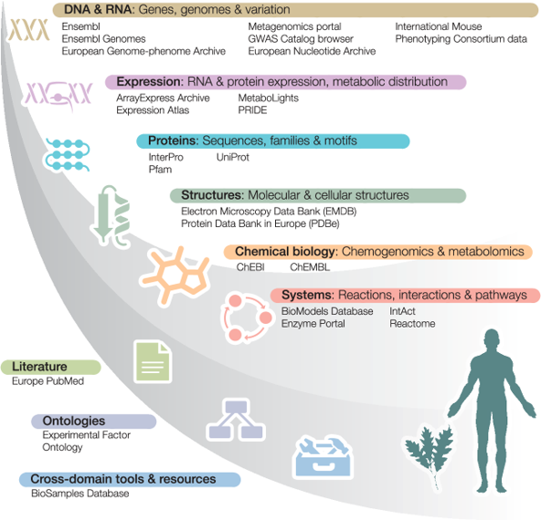

# Metadata Workshop
## Description
This workshop will expand on the [video introduction to metadata](https://leeds365-my.sharepoint.com/:v:/g/personal/fbsmbaw_leeds_ac_uk/EdX4ThFhs3VAj1CeBz8YyHYBZzar-nlTi6cAvBQ07HORoA?e=jQdmj2&nav=%7B%22playbackOptions%22%3A%7B%22startTimeInSeconds%22%3A11.94%7D%7D) and expand on it by looking at some biological databases and metadata.

## Learning outcomes

By the end of the workshop you will understand:

1. What metadata is.
2. Why metadata is important.
3. Some basic biological metadata types.
4. What makes good metadata.

## Format

This workshop will consist of several small group (~ 5 people) and individual activities on themes relating to the learning objectives and will run for ~ **50 minutes**.

- Activity 1: Meet and Greet Metadata.
- Activity 2: Biological Metadata.
- Activity 3: FAIR and Metadata

## Introduction

As mentioned in the video, [**metadata**](https://techterms.com/definition/metadata) can be thought of as data about data.  It is *structured* information that describes, explains, locates or make it easier to retrieve, use, or manage an information resource (data).

### Activity 1: Meet and Greet Metadata (5 minutes)

Introduce yourself to the rest of the group by describing yourself using 3 examples of personal metadata. For each one state whether it is **Descriptive**, **Structural** or **Administrative**.

  

***Question: Which metadata was most useful?*** 

## Biological metadata

As stated in The [European Bioinformatics Institute’s data resources 2014](https://pubmed.ncbi.nlm.nih.gov/24271396/):

*Molecular Biology has been at the heart of the 'big data' revolution from its very beginning, and the need for access to biological data is a common thread running from the 1965 publication of Dayhoff's 'Atlas of Protein Sequence and Structure' through the Human Genome Project in the late 1990s and early 2000s to today's population-scale sequencing initiatives.*

  

Big data has many implications for biology; for example [*how can we construct knowledge*](https://elifesciences.org/articles/47381#info)

## Activity 2: Biological Metadata (20 minutes)

**Individually** For each of the headings *DNA and RNA*, *Proteins*, *Structures*, and *Publications* think of a data type, database and three types of metadata (one descriptive, structural and administrative). **(10 minutes)**

We will then go through these examples **As a class** **(10 minutes)**

## FAIR Data

[**FAIR**](https://www.go-fair.org/fair-principles/) data refers to data that is **Findable**, **Accessible**, **Interoperable**, and **Reusable**. These principles were developed in order to improve the transparency, accountability, and reproducibility of research data, and to make it easier for researchers to access, use, and share data.

**Findable** data is data that can be easily located and identified by both humans and machines. This includes clear and descriptive metadata, as well as persistent and unique identifiers such as Digital Object Identifiers (DOIs).

**Accessible** data is data that can be easily accessed and downloaded by researchers, regardless of location or resources. This includes data that is freely available, as well as data that is available with appropriate permission and attribution.

**Interoperable** data is data that can be easily integrated and analyzed with other datasets, regardless of the software or hardware used. This includes the use of common data standards and formats, as well as clear documentation and metadata.

**Reusable** data is data that can be used for multiple purposes, either by the original researcher or by other researchers. This includes data that is well-documented, properly curated, and available under appropriate licenses.

Adhering to the principles of FAIR data helps to ensure the quality and integrity of research data, and makes it easier for researchers to build upon and extend previous work. It is increasingly being recognized as an important aspect of responsible and ethical research practices.

## Activity 3: FAIR and Metadata **(10 minutes)**

**In Groups** Choose one of the examples from **Activity 2** and discuss how the metadata types link to aspects of **FAIR DATA**.

## Useful Links

### EBI Online Tutorials

[Metadata: Describing Data Consistently](https://www.ebi.ac.uk/training/online/courses/bioinformatics-terrified/what-makes-a-good-bioinformatics-database/describing-data-consistently/) 

[Using Publicly Available Data](https://www.ebi.ac.uk/training/online/courses/using-publicly-available-data/)

