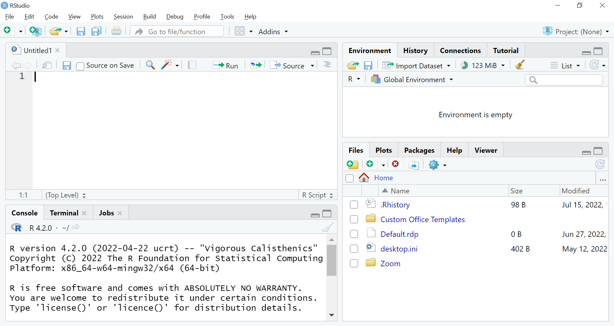

# Introduction to R Workshop
## Description
This workshop will expand on the [video introduction to R](https://mymedia.leeds.ac.uk/Mediasite/Play/ad914b5790304b7e8dbba292c6800a451d) and help you to get started using R Studio for yourself.

## Learning outcomes

By the end of the workshop you will understand:

1. How you can open R Studio.
2. How type code into a script and run it.
3. What a function and package is.
4. How to assign objects.

## Format

This workshop can be completed on your own or with others. You can use a university computer or your own laptop after you have installed R and R Studio on it..

- Activity 1: Open R Studio.
- Activity 2: Running code from a script.
- Activity 3: Functions.
- activity 4: Objects and assignment
- Activity 5: R Packages

## Introduction

As mentioned in the [video introduction to R](https://mymedia.leeds.ac.uk/Mediasite/Play/ad914b5790304b7e8dbba292c6800a451d) you can use R Studio on a university computer or download R and RStudio onto your laptop. Choose from the instructions below to open R Studio.

### Activity 1: Open R studio

When using a university computer in a cluster, use R and RStudio through AppsAnywhere. 

* Click the AppsAnywhere icon, scroll down to "Cran R" and click launch. 
* Once R has opened and downloaded onto the computer you can close it. 
* Now go back into Apps Anywhere to find RStudio and launch that.

If you only downloaded RStudio onto your computer it would not work. RStudio needs R installed to make it work.  

Use these links to download R and RStudio onto your own laptop.

[Download and install the latest version of R](https://www.r-project.org/)</kbd>  

[Download and install RStudio](https://www.rstudio.com/)</kbd>


### Activity 2: Running code from a script

Once R studio is open, click on the white square with the plus in green icon top left to open a script.

<p align="center">
  
</p>

The simplest thing you can do with R is use it as a calculator. Type the below into the script we just opened:

```{r}
1 + 100
```
Now run the code in R by pressing the Run command at the top left of the script window.

R will print out the answer, with a preceding `[1]`. Don't worry about this. Think of it as merely indicating what line the output is on.

If you type in an incomplete command, for example: 

~~~
> 1 +
~~~

R will show a `+` instead of a `>`. This means it's waiting for you to complete the command.  

If you want to cancel the command you can hit "Esc" and RStudio will give you back the ">" prompt.


### Activity 3: Functions

R has many built in functions (similar to excel functions). To call a function,
we can type its name, followed by brackets.
Anything we type inside the brackets is called the function's
arguments:

```{r}
log(15)  # natural logarithm
```
The text after each line of code is called a “comment”. Anything that follows after the hash symbol # is ignored by R when it executes code.

```{r}
sqrt(25) # square root
```

**Don't worry about trying to remember every function in R. You
can Google them, or if you can remember the
start of a function's name, use the tab completion in RStudio.**

We can also do comparisons in R:

```{r}
1 == 1  # equality (note two equals signs, read as "is equal to")
```

```{r}
1 != 2  # inequality (read as "is not equal to")
```

```{r}
1 >= -9 # greater than or equal to
```

### Activity 4: Objects and assignment

We can store values in **objects** using the assignment operator `<-`, like this:

```{r}
x <- 1/40
```

Notice that assignment does not print a value. Instead, we stored the number for later
in the object `x`. `x` now contains the **value** `0.025`:

```{r}
x
```

Look for the `Environment` tab in one of the panes of RStudio, and you will see that `x` and its value
have appeared. Our object `x` can be used in place of a number in any calculation that expects a number:

```{r}
log(x)
```

Objects can be reassigned:

```{r}
x <- 100
```

`x` used to contain the value 0.025 and now it has the value 100.

Assignment values can contain the object being assigned to:

```{r}
x <- x + 1 # notice how RStudio updates its description of x on the top right tab
y <- x * 2
```

Object names are not limited to `x` and `y`. They can contain letters, numbers, underscores and periods. They must start with a letter. They
cannot start with a number, underscore nor contain spaces at all. Different people use
different conventions for long variable names, these include

  * periods.between.words
  * underscores\_between_words
  * camelCaseToSeparateWords

What you use is up to you, but **be consistent**.

***Question***

Predict what the value of each object will be after each
of these lines of code?

```{r, eval=FALSE}
mass <- 40
age <- 122
mass <- mass * 2
age <- age - 20
```

***Question***

If we ran this code
```{r, eval=FALSE}
mass <- 40
age <- 122
```
What command would tell us if mass is greater than age?


### Activity 5: R Packages

It is possible to add functions to R by
installing a package written by someone else (or by writing your own package!) As of this writing, there
are over 18,000 packages available on CRAN (the comprehensive R archive
network). 


To install a package when using R on your own computer either:

* Type `install.packages("packagename")`,
  where `packagename` is the package name in quotes.
* Or, under the **Packages** tab, click **Install** and type the name of the package.

Installing a package only needs doing once unless you change the computer you are working on. 

Once a package is installed, it needs to be `library` loaded  before you can use it.

You can load a package and make it available for use with `library(packagename)`. Load the packages `ggplot2`, `penguins`

```{r ch5-sol, eval=FALSE}
library(ggplot2)
library(penguins)
```

Move these lines of code to the top of your script since this is where coders put them.


[Source](https://github.com/acriach/introtor_workshop)  

Adapted from [R for Reproducible Scientific Analysis](https://swcarpentry.github.io/r-novice-gapminder/) licensed [CC_BY 4.0](https://creativecommons.org/licenses/by/4.0/) by [The Carpentries](https://carpentries.org/)
